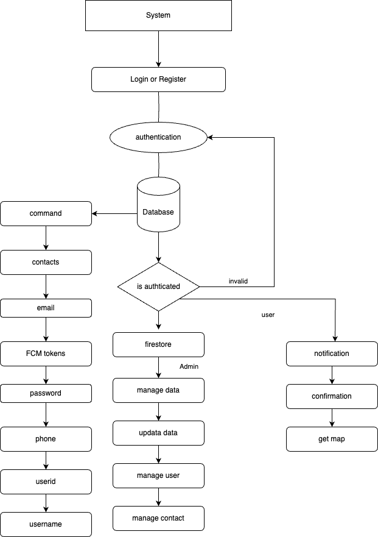
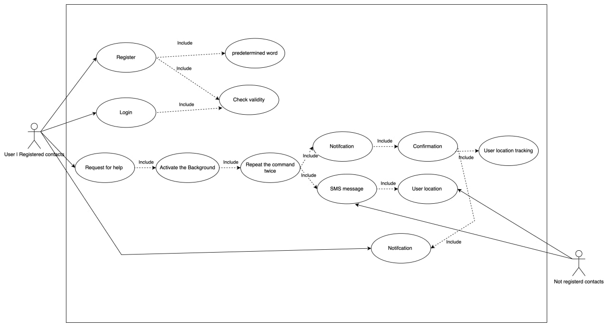
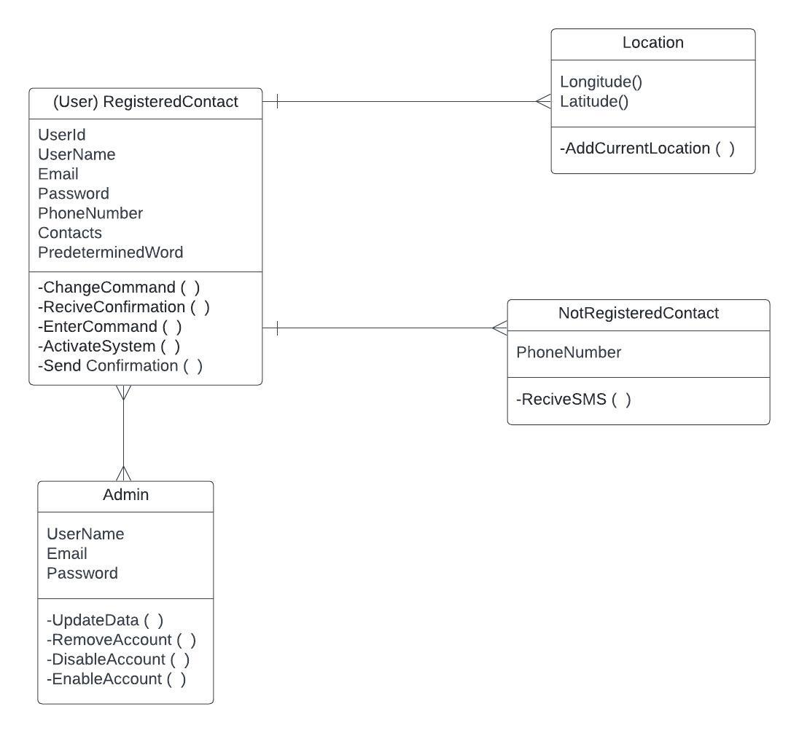
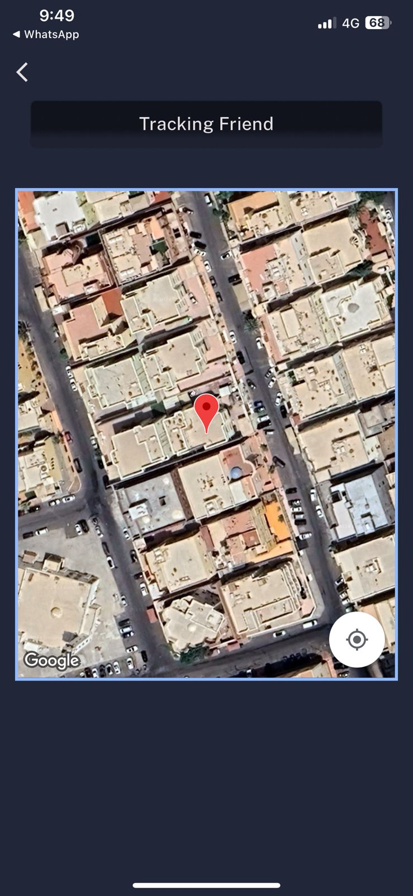
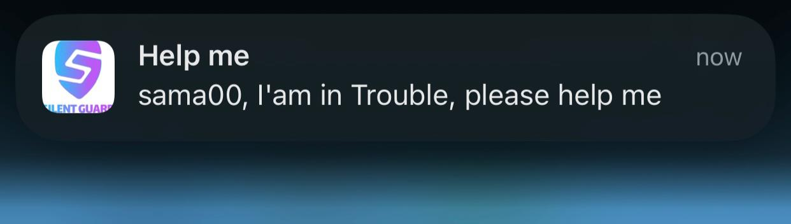
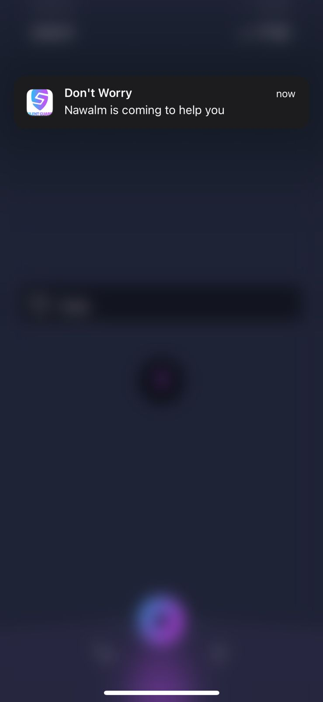

# SilentGuard — Intelligent Voice-Triggered Emergency Assistance System
🎓 Graduation Project | Applied AI & System Design

SilentGuard is a graduation project that presents an **intelligent emergency assistance system** designed to help users discreetly request help in dangerous or high-risk situations using **intentional voice command repetition**, combined with **real-time notifications and live location tracking**.

The system focuses on **user safety, reliability, and minimal interaction**, enabling emergency alerts to be triggered hands-free without drawing attention.

---

## 🚨 Problem Statement

In emergency situations, users may not be able to interact with their mobile devices manually (e.g., pressing buttons or navigating applications).  
Most traditional emergency solutions require visible or physical actions, which may not be safe or feasible under stress.

There is a need for a **hands-free, discreet, and reliable emergency activation mechanism** that allows users to request assistance without exposing themselves to additional risk.

---

## 💡 Proposed Solution

SilentGuard introduces a **voice-triggered emergency activation mechanism** based on controlled repetition:

1. The user defines a custom distress keyword (e.g., *“help”*).
2. The system continuously monitors audio input in the background.
3. When the keyword is **intentionally repeated**, the system confirms user intent.
4. Once activated, SilentGuard automatically:
   - Sends emergency notifications via the mobile application and/or SMS
   - Shares the user’s **live location** with selected contacts
   - Provides confirmation feedback once a contact accepts the rescue request

The repetition-based activation acts as a confirmation layer, reducing false activations while maintaining fast and reliable response.

---

## 🧠 System Overview

SilentGuard consists of the following high-level components:

- **Audio Monitoring Module**  
  Captures environmental audio input from the user’s device.

- **Speech Recognition Component**  
  Converts spoken audio into text using speech-to-text technology.

- **Activation Logic**  
  Detects intentional repetition of the predefined distress keyword.

- **Emergency Alert Module**  
  Sends notifications and SMS messages to trusted contacts.

- **Location Sharing Module**  
  Provides real-time location data to assist responders in reaching the user quickly.

---

## 🤖 AI Component (Actual Usage)

SilentGuard applies AI primarily through **speech-to-text technology** to recognize spoken distress keywords.

The intelligent aspects of the system include:

- Interpreting spoken audio using AI-based speech recognition
- Confirming user intent through controlled repetition
- Automating emergency workflows once activation conditions are met

The final activation decision is **rule-based**, ensuring predictability, transparency, and reliability in safety-critical scenarios.

---

## ⭐ Key Features

- Voice-triggered emergency activation
- Customizable distress keyword
- Reduced false activations via repetition confirmation
- Automated alerts via application and SMS
- Live location sharing with trusted contacts
- Designed for discreet, hands-free usage
- User and admin management capabilities

---

## 🧩 System Architecture

The following diagram illustrates the overall system structure, including authentication, backend services, notifications, and location tracking.

---

## 🔄 Use Case Diagram

This use case diagram demonstrates how users interact with the system, from registration and authentication to emergency activation and notification delivery.

---

## 🗂️ ER Diagram (Data Model)

The ER diagram shows the core entities in the system, including users, registered contacts, non-registered contacts, locations, and administrative roles.

---

## 📱 Application Screenshots

### Emergency Alert Screen
Displays the emergency alert sent to contacts when the system is triggered.

---

### Live Location Tracking
Shows the real-time location of the user to assist responders in reaching them quickly.

---

### Emergency Notification
Notification received by contacts indicating that the user is in danger and requires assistance.

---

### Rescue Confirmation
Confirmation message sent to reassure the user that help is on the way.

---

## 🛠️ Technologies & Tools

- Mobile Application Development
- Speech-to-Text / Voice Recognition
- Audio Signal Processing
- Real-Time Location Services (Maps)
- Notification Systems (In-app & SMS)
- Firebase / Firestore (Backend & Authentication)
- System Design & UML Modeling

---

## 👩‍💻 My Contributions

- Designed the overall system architecture and emergency workflow
- Defined the voice-based activation and confirmation logic
- Integrated speech recognition for keyword detection
- Implemented alerting and live location sharing mechanisms
- Contributed to system testing, validation, and technical documentation

---

## 🔒 Code Availability

The full implementation is **not publicly available** to protect the originality, security, and academic integrity of the graduation project.

This repository documents the **system design, architecture, and application flow**.  
Implementation details can be discussed during interviews if required.

---

## 📄 Academic Context

This project was developed as part of the graduation requirements for an **Artificial Intelligence** degree.  
Full academic documentation is available upon request.

---

## 📎 Repository Purpose

This repository aims to:

- Present the project concept and system design
- Demonstrate applied AI usage in a real-world safety scenario
- Showcase system thinking, problem-solving skills, and engineering decisions

